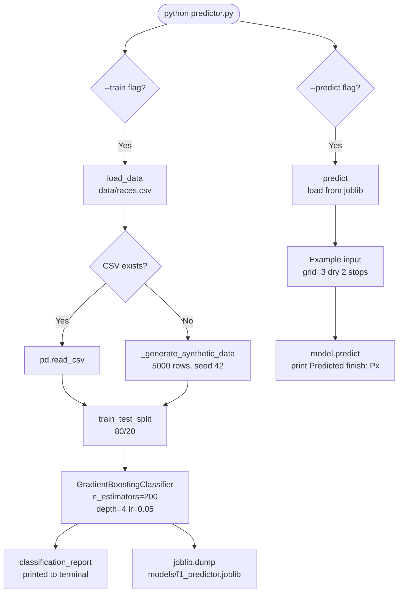

# F1 Race Predictor

[](https://github.com/isidhartha/f1-race-predictor/discussions)

Trains a gradient-boosted model on historical F1 race data to predict where a driver will finish, given a set of pre-race features. The idea is straightforward: grid position, qualifying pace, championship momentum, circuit familiarity, weather, and strategy choices all correlate meaningfully with race outcome. This tool tries to capture that relationship in a single Gradient Boosting Classifier.

You bring your own CSV of historical race data. If you don't have one yet, the script generates 5,000 rows of synthetic data — grid positions correlated with finishing positions plus realistic noise — so you can run a full train-evaluate cycle right away and see what the model produces before sourcing real data.

Once trained, the model saves to `models/f1_predictor.joblib` and can be loaded for predictions without retraining. The `--predict` flag runs a built-in example (P3 on the grid, dry conditions, 2 pit stops) and prints the predicted finish position.

## Features

- **GradientBoostingClassifier** with 200 estimators, max depth 4, learning rate 0.05 — tuned to give reasonable accuracy on 20-class classification without overfitting
- **8 pre-race input features** — grid position, qualifying lap time in ms, driver WDC points, constructor WCC points, circuit ID, weather code (0=dry/1=wet/2=mixed), safety car laps, and pit stop count
- **Synthetic data fallback** — generates 5,000 rows with `numpy.random.default_rng(42)` when no `data/races.csv` exists, so the pipeline always runs end to end
- **80/20 train-test split** with a full `classification_report` per finish position printed to terminal after training
- **Model persistence** via `joblib.dump` — saves to `models/f1_predictor.joblib`; `--predict` loads it without retraining
- **CLI interface** — `--train` to train, `--predict` to run the example prediction, both flags together to train then immediately predict
- **Example prediction** hardcoded in `__main__` — grid P3, dry, 2 stops — prints `Predicted finish position: Px`
- **CSV format documented** — nine-column spec with all feature and target column names ready for real race data

## Tech Stack

| Library | Purpose |
|---|---|
| `pandas` | CSV loading and data structuring |
| `numpy` | Synthetic data generation |
| `scikit-learn` | GradientBoostingClassifier, train/test split, classification report |
| `joblib` | Model serialization and loading |

## Setup

```bash
git clone https://github.com/isidhartha/f1-race-predictor.git
cd f1-race-predictor
pip install -r requirements.txt

# Train on synthetic data (no CSV needed)
python predictor.py --train

# Run the example prediction
python predictor.py --predict

# Train and predict in one shot
python predictor.py --train --predict
```

To use real data, place a CSV at `data/races.csv` with these columns:

| Column | Description |
|---|---|
| `grid_position` | Starting grid (1–20) |
| `qualifying_time_ms` | Fastest qualifying lap in milliseconds |
| `driver_points_before_race` | Driver WDC points before the race |
| `constructor_points_before_race` | Constructor WCC points before the race |
| `circuit_id` | Numeric circuit identifier |
| `weather_code` | 0=dry, 1=wet, 2=mixed |
| `safety_car_laps` | Number of safety car laps |
| `pit_stop_count` | Total pit stops in the race |
| `finish_position` | Actual finish position (target, 1–20) |

## Architecture



## Demo

> Screenshots coming soon.

## Contributing

See [CONTRIBUTING.md](CONTRIBUTING.md) for guidelines.

## License

MIT

## Author

[isidhartha](https://github.com/isidhartha)
