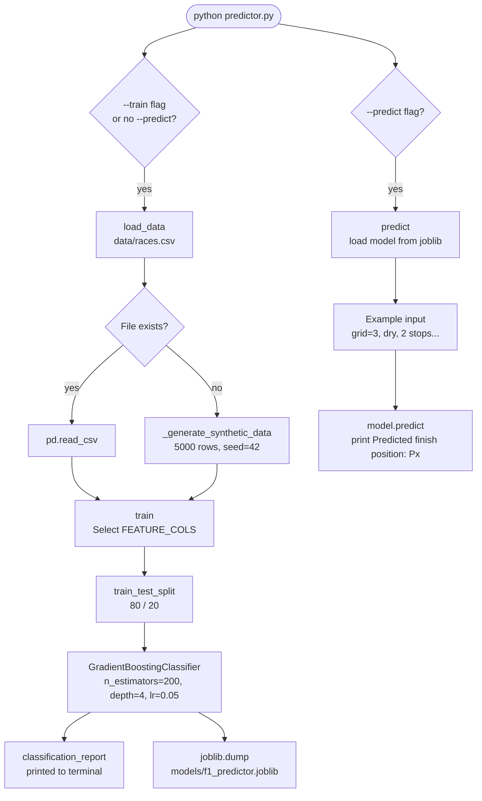

# F1 Race Predictor

A machine learning model that predicts Formula 1 race finishing positions from pre-race features. It trains a Gradient Boosting Classifier on historical race data (or synthetic data when no CSV is present), saves the trained model to disk, and can predict a finish position for any set of input features from the command line.

**Author:** Ram Sidhartha

---

## Features

- **Gradient Boosting Classifier** — `sklearn.ensemble.GradientBoostingClassifier` with 200 estimators, max depth 4, and learning rate 0.05
- **8 input features** — grid position, qualifying time (ms), driver championship points before the race, constructor championship points before the race, circuit ID, weather code (0=dry / 1=wet / 2=mixed), safety car laps, and pit stop count
- **Synthetic data fallback** — when no `data/races.csv` file is found, the script generates 5,000 synthetic rows with grid position correlated to finish position plus random noise, so you can run a full train/evaluate cycle immediately without needing real data
- **Train/test split evaluation** — 80/20 split with a full `classification_report` printed to the terminal showing per-position precision, recall, and F1-score
- **Model persistence** — trained model is saved to `models/f1_predictor.joblib` using `joblib`; subsequent `--predict` runs load the saved model without retraining
- **Example prediction** — `--predict` runs a hardcoded example (grid P3, dry conditions, 2 pit stops) and prints the predicted finish position

---

## Tech Stack

| Library | Purpose |
|---|---|
| `pandas` | Loading and structuring the training CSV |
| `numpy` | Synthetic data generation |
| `scikit-learn` | GradientBoostingClassifier, train/test split, LabelEncoder, classification report |
| `joblib` | Model serialization and loading |

---

## Setup

```bash
pip install -r requirements.txt

# Train the model (uses synthetic data if data/races.csv is absent)
python predictor.py --train

# Run the example prediction (trains first if no saved model exists)
python predictor.py --predict

# Train and then immediately predict
python predictor.py --train --predict
```

The trained model is saved to `models/f1_predictor.joblib` and can be reloaded by any subsequent `--predict` run without retraining.

---

## Training Data Format

Place a CSV file at `data/races.csv` with the following columns to train on real data:

| Column | Description |
|---|---|
| `grid_position` | Starting grid position (1–20) |
| `qualifying_time_ms` | Fastest qualifying lap in milliseconds |
| `driver_points_before_race` | Driver's WDC points before the race weekend |
| `constructor_points_before_race` | Constructor's WCC points before the race weekend |
| `circuit_id` | Numeric circuit identifier |
| `weather_code` | 0 = dry, 1 = wet, 2 = mixed |
| `safety_car_laps` | Number of laps run behind the safety car |
| `pit_stop_count` | Number of pit stops made during the race |
| `finish_position` | Actual finish position (target label, 1–20) |

If this file is absent the script generates synthetic data automatically.

---

## Code Architecture



---

## Example Prediction Input

The built-in example used by `--predict`:

| Feature | Value |
|---|---|
| `grid_position` | 3 |
| `qualifying_time_ms` | 78500 |
| `driver_points_before_race` | 210 |
| `constructor_points_before_race` | 380 |
| `circuit_id` | 5 |
| `weather_code` | 0 (dry) |
| `safety_car_laps` | 2 |
| `pit_stop_count` | 2 |

---

## Screenshots

_Screenshots coming soon._

---

## License

This project is licensed under the MIT License. See [LICENSE](LICENSE) for details.
